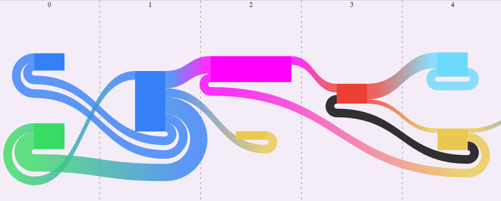

# SanKEY.js v1.0.0
*last updated: 20.07.2022*


## __Getting started__
SanKEY.js is a JavaScript data visualization library that provides a simple object-oriented API to create interactive column-ordered Sankey diagrams. It's free of dependencies and written in vanilla JavaScript. SanKEY.js was designed with the goal of maximum performance, so it works faster than any other library used for the purpose of creating Sankey diagrams. It allows a high level of customization with features like special link shapes, adjustable nodes width and integrated callback functions. The possibility of easily creating plots with thousands of columns and tens of thousands of nodes and links redefines the capabilities of Sankey diagrams and opens new horizons for their usage.

## __Usage__
SanKEY.js is provided as an ES6 module. To use the library, download "SanKEY_script.js" and include the line below in your main script file. 
```javascript
import {PlotCreator} from './SanKEY_script.js'
```
__Remember to add *type=module* declaration while including your script in an HTML document__.  
SanKEY.js also requires "SanKEY_styles.css" to work properly. This CSS file can be modified to change some basic library styles. Read more about it in the documentation section. The full HTML declaration should look more or less like this:  
```html
<script type="module" src="./your_main_script.js"></script>
<link rel="stylesheet" href='./SanKEY_styles.css'>
```
## __Customize your plots however you want__
SanKEY.js offers possibilities like no other library.  
  

__Code of this example__:
```javascript
import {PlotCreator} from './SanKEY_script.js'
let nodes = [
    [{label:'A'}, {label:'C'}],
    [{label:'A'}],
    [{label:'Any label', width: 0.8, color:'#ff00ff'},{label:'G'}],
    [{label:'T'}],
    [{label:'A', color: '#6dd9fa'}, {label:'G'}],
    [],[{label: 'A', width: 2 }],[],[],
]
let links =[
    {from:{column: 0, node: 1}, to:{column: 1, node: 0}, value:1, link_type: 'LL'},
    {from:{column: 0, node: 0}, to:{column: 1, node: 0}, value:1, link_type: 'LR'},
    {from:{column: 0, node: 0}, to:{column: 1, node: 0}, value:1, link_type: 'LR'},
    {from:{column: 0, node: 1}, to:{column: 1, node: 0}, value:2, link_type: 'LR'},
    {from:{column: 1, node: 0}, to:{column: 2, node: 0}, value:2, link_type: 'RL'},
    {from:{column: 1, node: 0}, to:{column: 2, node: 1}, value:1, link_type: 'RR'},
    {from:{column: 2, node: 0}, to:{column: 3, node: 0}, value:1},
    {from:{column: 2, node: 0}, to:{column: 4, node: 1}, value:1, link_type: "LR"},
    {from:{column: 3, node: 0}, to:{column: 4, node: 0}, value:1.8},
    {from:{column: 3, node: 0}, to:{column: 4, node: 1}, value:1, link_type: 'LR', color: 'black'},
    {from:{column: 3, node: 0}, to:{column: 4, node: 1}, value:0.5},
    {from:{column: 4, node: 1}, to:{column: 6, node: 0}, value:0.5},
    {from:{column: 4, node: 0}, to:{column: 4, node: 0}, value:1},
]
new PlotCreator(
    document.body, nodes, links, 1000, 400, 0, 5,
    {
        plot_background_color: '#f4edf7',
        default_links_opacity: 0.8,
        default_gradient_links_opacity: 0.8,
        label_colors_object: {A: "#3680f7", C: "#39db64", T: '#eb4034', G: '#ebc950', 'Any label': 'magenta'},
        lines_style_object: {stroke:'black','stroke-opacity':0.2},
        column_names_style_object: { color:'black', opacity:0.6,},
    }
)
```

## __Documentation__
To generate a plot, simply create an instance of the PlotCreator class.  
### __What you need to know about PlotCreator class:__
Interactions with the plot, such as changing the plot range, can be achieved by using methods of the class. Each time a method is called, the plot is refreshed, that is, the old plot element on the page is removed and a new one is generated. If the nodes were moved, it is remembered, and refreshing the plot won't change their positions in relation to the columns.  
Most of the PlotCreator properties are not private (yet) and theoretically could be modified. However, in most cases it's not recommended. It is advised to use proper methods in order to change them.  
Nodes and links data are kept as references to reduce memory usage. Thus, modifying them will impact the PlotCreator object. Adding or removing columns/nodes/links is strongly discouraged, however, changing individual properties such as colors or labels can be beneficial. In such a case, to observe a change, the plot needs to be refreshed.  
It's important to mention that in some cases links_data will be slightly modified by PlotCreator. More about it below.  
The nodes must have a fixed order in the columns. They will be created according to this order, from top to bottom.  
## PlotCreator class
Main class for generating and managing the Sankey diagrams. It requires 7 arguments:  
* dom_container - *HTMLelement* - DOM element inside which the plot will be created.
* nodes_data - *(see description)* - Nodes data.
* links_data - *(see description)* - Links data.
* plot_width - *number* - Width of the plot in pixels.
* plot_height - *number* - Height of the plot in pixels.
* first_column - *number* - Index of the first column to be shown.
* last_column - *number* - Index of the first column that won't be shown. 
* settings (Optional) - *Object* - Object with additional plot settings.


### **- dom_container**   
DOM element in which the plot will be created. Creating a plot inside it may override some of its default styles. In particular, it will set the *overflow* to '*auto*'.
### **- nodes_data**  
A structure that describes the nodes to be created. It should have a form of an array with nested arrays, where each array denotes a new column. The order of the nodes inside the columns is important, because to define a link, the user must specify it for both nodes that the link connects *(see links_data)*.
Arrays describing the columns should be empty or contain objects representing the nodes. 
The user can define any properties in node objects. PlotCreator will recognize: _label_, _color_ and _width_.  
__Properties defined here will have a higher priority than those defined as default for the entire plot.__
* _width_ (Optional) - a positive floating-point number that indicates what fraction of the column width will the node occupy. Values >1 mean that the node will span horizontally beyond the column.  
* _color_ (Optional) -  any CSS color. Color of the node. 
* _label_ (Optional) - any string. It will be displayed when the user hovers a node.

Example:
```javascript
[
    [{label:'A'}, {}],
    [{label:'A'}],
    [{label:'Any label name', width:0.8, color:'#ff00ff'},{label:'B'}],
    [{label:'T'}],
    [{label:'A', color:'#6dd9fa'}, {label:'B'}],
    [],
    [{label:'A', width:2}],
    [],
    []
]
```
### **- links_data**  
It's a data structure that describes the links. It should be an array (with no fixed order needed), in which each object represents one link. *Note: the array will be sorted by the PlotCreator*. Each link should contain information about the nodes it connects, by specifying the column indexes and __positions__ of the nodes. In addition, it's necessary to specify the *value* of the link, which will later be converted to its height accordingly. The user can define any properties in link objects. PlotCreator will recognize: _link_type_, _color_ and _sublinks_.  
__Properties defined here will have a higher priority than those defined as defaults for the entire plot.__
* _from_ - object with *column* and *position* properties defined. It describes the coordinates of the node from which the link goes. *Position* is the node's index in the column array.
* _to_ - object with *column* and *position* properties defined.  It Describes the coordinates of the node to which the link goes. *Position* is the node's index in the column array.
* _value_ - number, value of the link.
* _link_type_ (Optional) - string, one of ['RL','RR','LR','LL']. Describes the shape of the link. If not specified, 'RL' is assumed. The first letter describes on which side of the first node the link will be created, and the second - on which side of the second one. Connections between nodes can be specified from further columns to the previous ones. In such cases, due to library's internal architecture, link_type will be overwritten and the *reversed=true* property will be added.
* _color_ (Optional) - any CSS color. Color of the link. 
* _sublinks_ (Optional) - an array of sublink objects. Sublinks are separate links that are included in the area of the link. The shape of the sublink is inherited from its parent link. Objects describing sublinks should have defined *value* and *shift* properties. *Value* is interpreted in the same way as in normal links. *Shift* is a positive number and defines by what fraction of the parent's link height is the sublink shifted downwards, in relation to the parent's link upper edge. To simplify, *shift=0.5* means that the top edge of the sublink will be exactly in the middle of the parent link's height. In addition, each sublink can have its own unique *color* defined. Unlike normal links, sublinks are parsed every time the plot is refreshed, so they can be used, for example, to dynamically highlight paths in the diagram. *Note: nested sublinks won't be parsed*.

Example:
```javascript
[
    {from:{column: 0, node: 1}, to:{column: 1, node: 0}, value:1, link_type: 'LL'},
    {from:{column: 0, node: 0}, to:{column: 1, node: 0}, value:1, link_type: 'LR'},
    {from:{column: 0, node: 0}, to:{column: 1, node: 0}, value:1, link_type: 'LR'},
    {from:{column: 0, node: 1}, to:{column: 1, node: 0}, value:2, link_type: 'LR'},
    {from:{column: 1, node: 0}, to:{column: 2, node: 0}, value:2, link_type: 'RL'},
    {from:{column: 1, node: 0}, to:{column: 2, node: 1}, value:1, link_type: 'RR'},
    {from:{column: 2, node: 0}, to:{column: 3, node: 0}, value:1},
    {from:{column: 2, node: 0}, to:{column: 4, node: 1}, value:1, link_type: 'LR'},
    {from:{column: 3, node: 0}, to:{column: 4, node: 0}, value:1.8, sublinks: [{shift:0.1, value: 1.2, color:'magenta'}]},
    {from:{column: 3, node: 0}, to:{column: 4, node: 1}, value:1, link_type: 'LR', color: 'black'},
    {from:{column: 3, node: 0}, to:{column: 4, node: 1}, value:0.5},
    {from:{column: 4, node: 1}, to:{column: 6, node: 0}, value:0.5},
]
```
### **- plot_width**  
Number, width of the plot in pixels.
### **- plot_height**  
Number, height of the plot in pixels.
### **- first_column**
Number, index of the first column to be shown when the plot is initially generated.
### **- last_column**
Number, index of the first column that won't be shown when the plot is initially generated.
### **- settings (Optional)**
As an eighth argument, the user can additionally pass an object with settings, that will impact plot's styling and usability. All settings are optional. PlotCreator will recognize the following properties:

#### **- vertical_gap_between_nodes**
Number between 0 and 1. Minimal size of the total vertical gap between nodes in a column (as a height fraction). E.g. *0.6* means that in each column at least 60% of its height will be the spacing between nodes. The default value is *0.7*.
#### **- node_percent_of_column_width**
Number between 0 and 1. Standard node width as a fraction of the column width. E.g. *0.6* means that each node will occupy 60% of the column width. The default value is *0.3*.
#### **- show_column_lines**
Boolean, determines whether to show the lines between columns. The default value is *true*.
#### **- show_column_names**
Boolean, determines whether to show the column names. The default value is *true*.
#### **- show_links_out_of_range**
Boolean, determines whether to show links in a situation where both nodes are not in the range of the plot, but the link between them is. If set to *true*, each time the plot is being refreshed, PlotCreator will look for such links, by scanning *k* nearest columns on each side of the column range, where *k* is the *length* of the longest link in the graph and *length* being defined as *|column_of_the_first_node - column_of_the_second_node|*. This may negatively impact the performance, however, unless there are links with the *length* around several thousand columns, the slowdown should not be noticeable. The default value is *true*.
#### **- node_move_y**
Boolean, determines whether the nodes can be moved vertically. The default value is *true*.
#### **- linear_gradient_links**
Boolean, determines whether the links should have a gradient color. The default value is *true*.
#### **- plot_background_color**
Any CSS color. Plot background color. The default value is *'#f5ecec'*.
#### **- default_nodes_color**
Any CSS color. Default nodes color. The default value is *'grey'*.
#### **- default_links_color**
Any CSS color. Default links color. The default value is *'blue'*.
#### **- default_links_opacity**
Number between 0 and 1. Default links opacity. The default value is *0.25*.
#### **- default_gradient_links_opacity**
Number between 0 and 1. Default opacity of links if those have a gradient color. The default value is *0.43*.
#### **- default_sublinks_color**
Any CSS color. Default sublinks color. The default value is *'red'*.
#### **- default_sublinks_opacity**
Number between 0 and 1. Default sublinks opacity. The default value is *0.8*.
#### **- label_colors_object**
An object in which node labels are properties and node colors are the values. By defining such an object, the user can easily link node labels to their color, thus avoiding code redundancy. The default value is *{}*.
#### **- column_names**
An array of column names. If passed, then instead of column indexes, names from this array will be displayed. The default value is *undefined*.
#### **- start_column_count_from**
Number, determines from which number columns are being indexed. __Important: this will only impact the display and PlotCreator’s interface. While defining nodes and links data, the user still needs to use the standard array indexes.__ The default value is *0*.
#### **- start_node_count_from**
Number, determines from which number nodes in the columns are  being indexed. __Important: this will only impact the display and PlotCreator’s interface. While defining nodes and links data, the user still needs to use the standard array indexes.__ The default value is *0*.
#### **- link_min_arc**
Number, minimal curvature of the arc when the links have a curved shape, for example when a link connects the left sides of both nodes. The default value is *5*.
#### **- link_arc_iterated_increase**
Number, determines by how many pixels should increase the arc of the curved links when these are stacked. The default value is *5*.
#### **- lines_style_object**
An object that defines styles of the lines between the columns. PlotCreator will recognize all properties that are also defined in the default object and only overwrite those defined by the user. The default values are: *{stroke: 'red', 'stroke-width': 2, 'stroke-opacity': 0.35, 'stroke-dasharray': '5,5'}*.
#### **- column_names_style_object**
An object that defines styles of the column names. PlotCreator will recognize all properties that are also defined in the default object and only overwrite those defined by the user. The default values are: *{'font-size':'15px', color:'red', opacity:0.50,'font-weight':'bold'}*.
#### **- hover_node_cursor**
String, appearance of the cursor when a node is being hovered. The default value is *'pointer'*.
#### **- hover_link_cursor**
String, appearance of the cursor when a link is being hovered. The default value is *'help'*.
#### **- grabbing_node_cursor**
String, appearance of the cursor when a node is being grabbed. The default value is *'grabbing'*.
#### **- on_node_click_function**
Function that will be executed after a node is clicked. PlotCreator will try to pass four arguments to it: *node_info*, *node_data_reference*, *node_element* and *event*.
* *node_info* - an object with the information about a clicked node.
    * *label* - node's label
    * *height* - node's height
    * *number_of_links* - total number of links in a node 
    * *number_of_links_left* - number of links on the left side of the node 
    * *number_of_links_right* - number of links on the right side of the node 
    * *left_side_sum* - sum of the values of the links on the left side of the node 
    * *right_side_sum* - sum of the values of the links on the right side of the node 
    * *column* - index of the node's column
    * *position* - index of the node in a column
* *node_data_reference* - a reference to a defined data object about the chosen node
* *node_element* - node's DOM SVG rectangle element
* *event* - event object

The default value is *undefined*.
#### **- on_link_click_function**
Function that will be executed after a link is clicked. PlotCreator will try to pass four arguments to it: *link_info*, *link_data_reference*, *link_element* and *event*.
* *link_info* - an object with information about the clicked link.
    * *from_column* - name/index of the column, from which the link goes
    * *to_column* - name/index of the column, to which the link goes
    * *from_node* - index of the node from which the link goes
    * *to_node* - index of the node to which the link goes
    * *from_label* - label of the node from which the link goes
    * *to_label* - label of the node to which the link goes
    * *value* - value of the link
* *link_data_reference* - a reference to a defined data object about the chosen llink
* *link_element* - link's DOM SVG path element
* *event* - event object

The default value is *undefined*.
#### **- on_node_hover_function**
Function that will be executed after a node is hovered. PlotCreator will try to pass four arguments to it: *node_info*, *node_data_reference*, *node_element* and *event*, same as in *on_node_click_function*. **Important: the return value of this function will be set as info bubble's inner HTML**. The default value is:
```javascript
(node_info,node_data_reference,node_element,event)=>{return `${node_info['label']}`}
```

#### **- on_link_hover_function**
Function that will be executed after a link is hovered. PlotCreator will try to pass four arguments to it: *link_info*, *link_data_reference*, *link_element* and *event*, same as in *on_link_click_function*. **Important: the return value of this function will be set as info bubble's inner HTML**. The default value is:
```javascript
(link_info,link_data_reference,link_element,event)=>{
    return `From: (column - ${link_info['from_column']}, node - ${link_info['from_node']}, label - "${link_info['from_label']}") To: (column - ${link_info['to_column']}, node - ${link_info['to_node']}, label - "${link_info['to_label']}") Value: ${link_info['value']}`
}
```


### **PlotCreator methods:**
After the plot is initially generated, the methods allow interacting with it to, for example, change some of the default properties.

### **- changeColumnRange(first_column: number, last_column: number)**
Changes current column range. Refreshes the plot. *First_column* and *last_column* are column indexes. *Note, that if the default *start_column_count_from* was changed, then the indexes here must be shifted accordingly.
### **- columnNames(boolean)**
Allows changing whether column names are being displayed. Refreshes the plot.
### **- columnLines(boolean)**
Allows changing whether lines between columns are being displayed. Refreshes the plot.
### **- yMovement(boolean)**
Allows changing whether nodes can be moved vertically. Refreshes the plot.
### **- linearGradient(boolean)**
Allows changing whether links have a gradient color. Refreshes the plot.
### **- removePlot()**
Method that should be used when one wants to remove the plot from DOM and from the memory. *Note, that all references pointing to that object should also be removed*.
### **- reloadPlot()**
Plot refresh. Useful when the plot data is manually modified.

## set_attributes(dom_element, arg_val_object)
Additional function. Sets multiple attributes to a DOM element. Can be imported.
* dom_element - *HTMLelement* - Target DOM Element.
* arg_val_object - *Object* - Object with the attributes to be set.

## CSS stylesheet
As aforementioned, SanKEY.js requires SanKEY_styles.css to work properly. The file is short and contains classes that allow modifying the following things:
* on hover appearance and animations of nodes and links
* appearance and animations of info bubbles
* mobile functionality

We recommend customizing it to one's needs.  

## __Additional information__
Work on the library is still in progress. Please contact us if you find any bugs or mistakes.  
A short guide to using the library will be added soon.  
**It is forbidden to distribute the internal library code as your own in any external repositories.**  

The library was created and is maintained by Krzysztof Zdąbłasz.  
I would like to thank Zuzanna Czerska for her help with non-programming works.  
e-mail: krzysiek.zdablasz@gmail.com

